<div align="center">

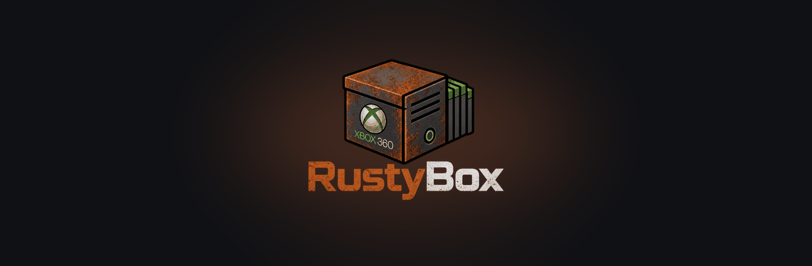

# RustyBox

### The self-hosted control centre for your modded Xbox 360

Organise every game you own, convert ISOs to Games on Demand, find and download new ones, and send them to your console, all from one fast, beautiful web app that runs on a box in your cupboard.

<br>

[](https://hub.docker.com/r/wb20244/rustybox)
[](https://hub.docker.com/r/wb20244/rustybox)
[](https://www.rust-lang.org)
[](LICENSE)
[](docs/plan.md)

**[Quick start](#-quick-start)** &nbsp;·&nbsp; **[Features](#-what-it-does)** &nbsp;·&nbsp; **[Screenshots](#-screenshots)** &nbsp;·&nbsp; **[How to use it](#-how-to-use-it)** &nbsp;·&nbsp; **[Docs](docs/README.md)**

</div>

<br>

<div align="center">

## ☕ RustyBox is free. Help keep it that way.

**Every feature you see here was built by one person, in evenings and weekends, and given away for nothing.**<br>
No ads. No subscriptions. No tracking. No paywalled "pro" tier. Ever.

**If RustyBox saved you an afternoon of fighting folders, converting discs or copying games to a console, a coffee is the nicest way to say thanks. It pays for the late nights and it directly decides what gets built next.**

<br>

<a href="https://buymeacoffee.com/succinctrecords"></a>

**🧡 Every coffee = more features, faster fixes, and a very happy developer. Thank you!**

</div>

<br>

---

## ✨ What it does

| | |
|---|---|
| 📚 **One library for everything** | ISOs, Games on Demand, mods, trainers, homebrew, saves, title updates and emulators, spread across as many disks and shares as you like. Duplicates, damaged copies and missing files are spotted for you. |
| 🎮 **Games with cover art** | Every game matched by title ID and dressed with cover art, genres and descriptions from IGDB. Search, sort, filter, list or covers view. |
| 🔄 **Convert in one click** | ISO ⇄ Games on Demand, unpack to a folder, build an ISO from a folder, check and fix ISOs. Multi-disc games handled. Every action shows a plan first. |
| 🕹️ **Straight to the console** | Browse, scan, compare and send games to your Xbox 360 over FTP (Aurora). Replace a game without losing its saves. |
| 💽 **Manage the Xbox's hard drive** | Compare the drive with your library, mirror it, tidy it, and find add-ons and updates that are in the wrong folder, without ever unplugging it from its PC. |
| 🧭 **Discover and download** | Browse every Xbox 360 game on IGDB, see similar games, then grab one from **Usenet or torrents**. It is downloaded, converted to GOD, put in your library, copied to the drive and sent to the console, automatically if you want. |
| 🧲 **Torrents, your way** | Search torrent indexers like you do Usenet, or open a `.torrent` file, **tick just the files you want** out of thousands, and qBittorrent downloads only those. From a wanted game, **search inside your torrent files** (pick the folder, or one torrent) and grab just that game. |
| 🧩 **Mods, trainers and updates** | Install mods, trainers and homebrew, and find and install title updates, all with a preview of exactly where each file goes. |
| 🔌 **USB tools** | Build a Bad Avatar stick, format and back up USB drives. Only removable sticks are ever offered. |
| 🛡️ **Safe by design** | Plan before you act. Nothing is deleted or overwritten without a preview you approve. Writes go to `.part` files and are renamed when complete. |

<br>

## 📸 Screenshots

<p align="center">
  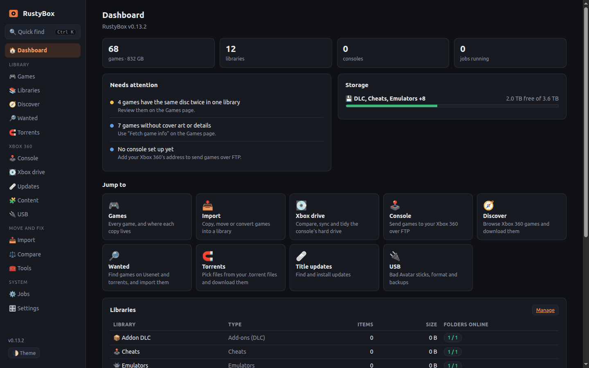<br>
  <sub><b>Dashboard</b>: what needs attention, storage at a glance, and one click to anywhere.</sub>
</p>

<table>
  <tr>
    <td width="50%">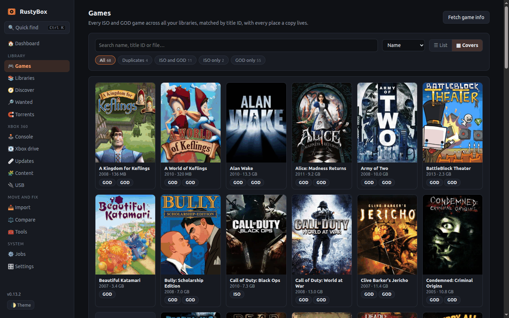<br><sub><b>Games</b>: covers view. Every game across every library.</sub></td>
    <td width="50%">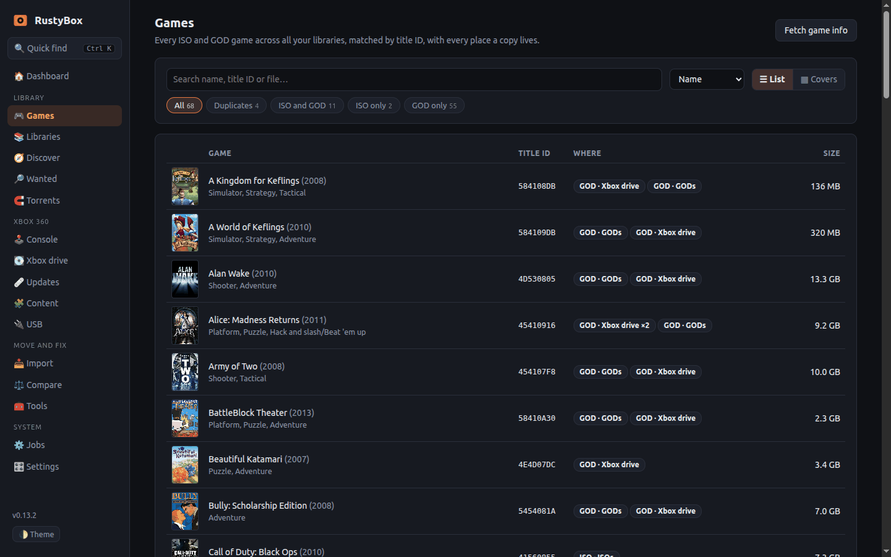<br><sub><b>Games</b>: list view, showing where each copy lives.</sub></td>
  </tr>
  <tr>
    <td width="50%">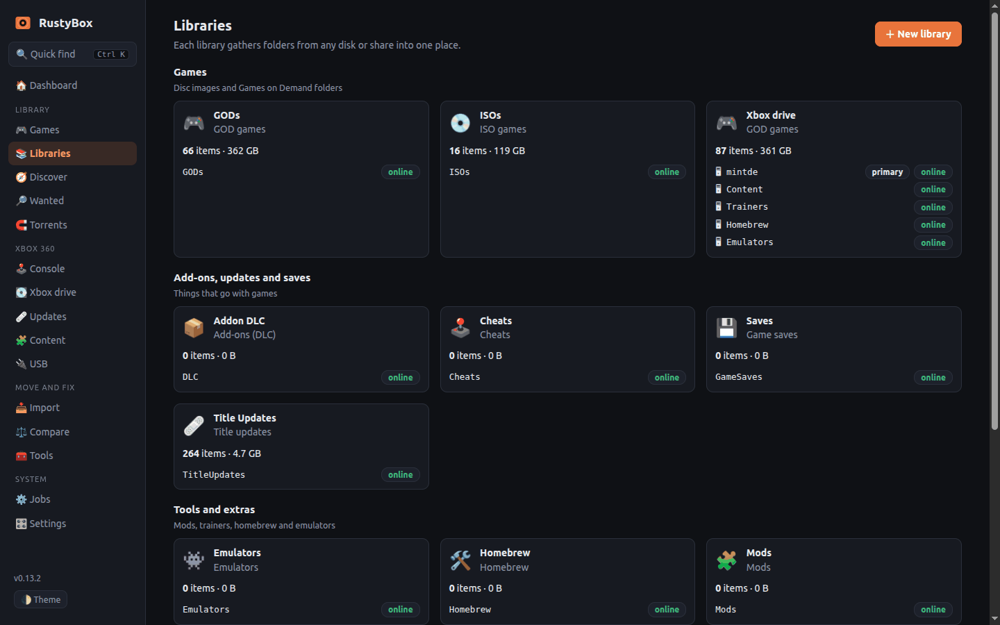<br><sub><b>Libraries</b>: any folder on any disk, grouped by purpose.</sub></td>
    <td width="50%">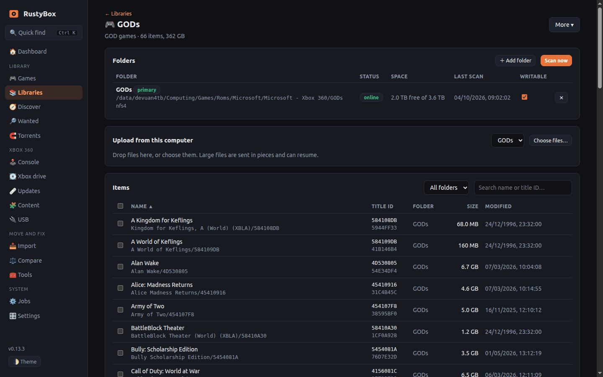<br><sub><b>A library</b>: sortable, searchable, convert and send from here.</sub></td>
  </tr>
  <tr>
    <td width="50%">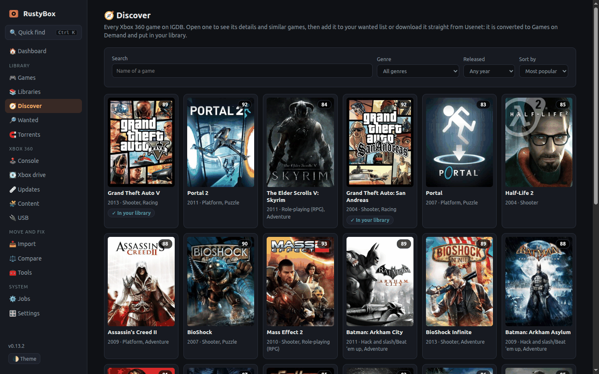<br><sub><b>Discover</b>: browse every Xbox 360 game and download it.</sub></td>
    <td width="50%">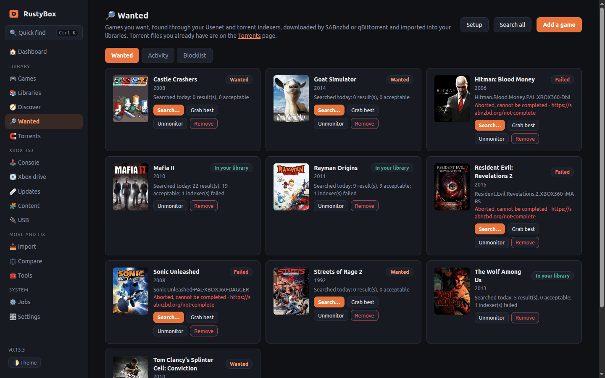<br><sub><b>Wanted</b>: Radarr-style tracking for the games you want.</sub></td>
  </tr>
  <tr>
    <td width="50%">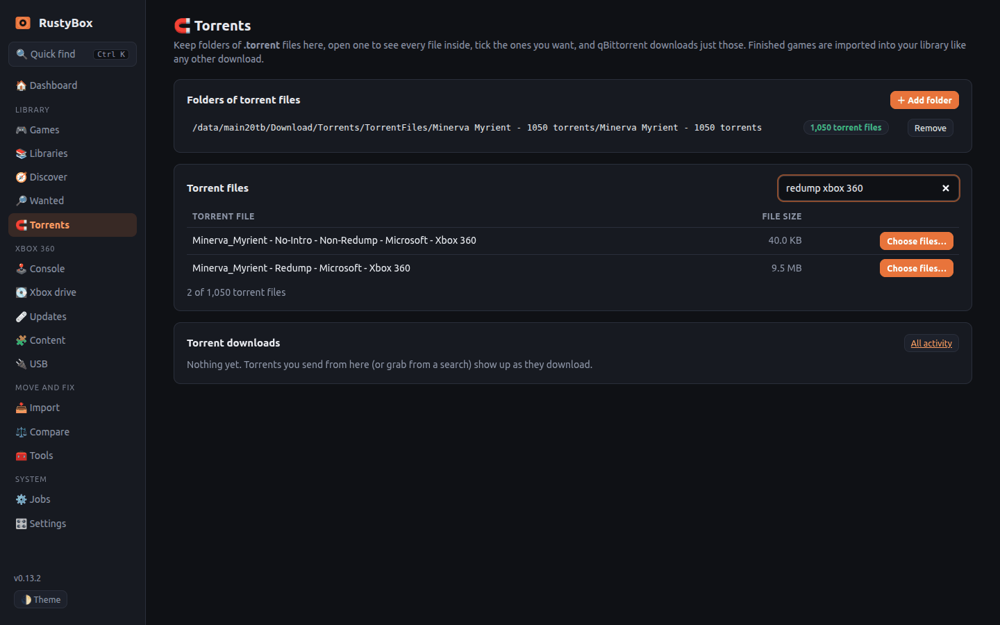<br><sub><b>Torrents</b>: browse your folders of .torrent files.</sub></td>
    <td width="50%">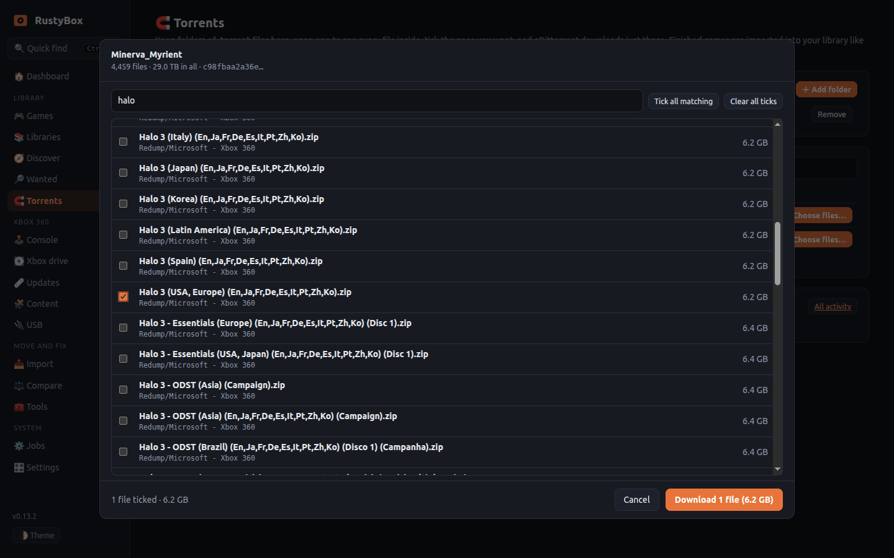<br><sub><b>Pick files</b>: tick the games you want out of 4,459.</sub></td>
  </tr>
  <tr>
    <td width="50%">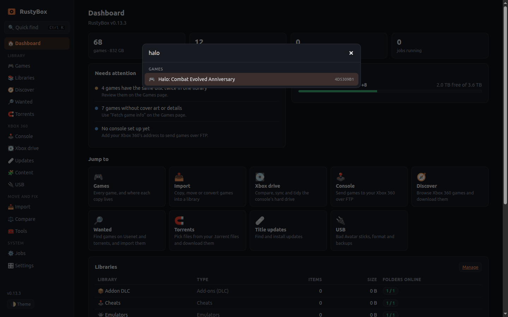<br><sub><b>Quick find</b>: <kbd>Ctrl</kbd>+<kbd>K</kbd> jumps to anything.</sub></td>
    <td width="50%">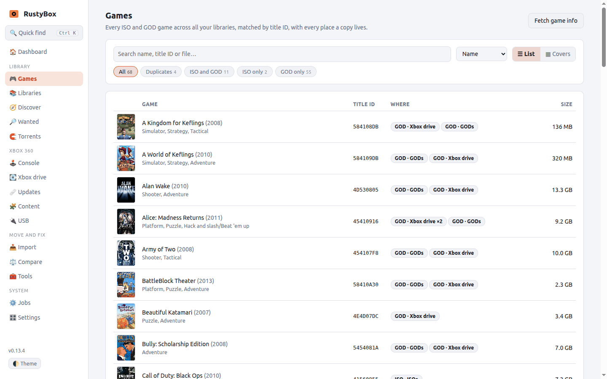<br><sub><b>Light and dark</b>: follows your system, or switch by hand.</sub></td>
  </tr>
</table>

<p align="center">
  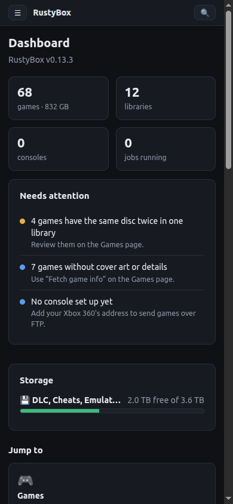
  &nbsp;
  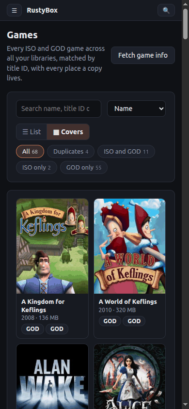<br>
  <sub><b>Works on your phone</b>: a proper mobile layout, not an afterthought.</sub>
</p>

<br>

## 🚀 Quick start

You need Docker with Compose and a folder of games. That's it.

**1. Save this as `compose.yaml`**

```yaml
services:
  rustybox:
    image: wb20244/rustybox:latest
    container_name: rustybox
    restart: unless-stopped
    init: true
    ports:
      - "8088:8080"                        # the web interface
    volumes:
      - ./config:/config                   # settings and the index
      - /path/to/your/games:/data/games    # change the left side to your own folder
    environment:
      RUSTYBOX_PUID: "1000"                # who owns files RustyBox creates
      RUSTYBOX_PGID: "1000"
```

**2. Start it**

```bash
docker compose up -d
```

**3. Open <http://localhost:8088>** (or `http://<your-server>:8088`) and follow the first-run checklist below.

> **Just want to look around first?** Run `docker run --rm -p 8088:8080 wb20244/rustybox serve --mock` for a demo with a pretend console, drives and network. Nothing real is touched.

<details>
<summary><b>First-run checklist</b> (about five minutes)</summary>

<br>

1. **Libraries → New library.** Pick a type (ISO games, GOD games, …), add your folder, press **Scan now**.
2. Open **Games**. Everything found is listed, matched by title ID.
3. **Settings → Game information.** Paste a free Twitch client ID and secret (the page shows how) to get cover art and descriptions, then press **Fetch game info** on the Games page.
4. *Optional:* add your console (**Console**), connect the Xbox's hard drive (**Xbox drive**), set up downloads (**Wanted → Setup**), and turn on a login (**Settings → Security**) if the server is shared.

</details>

Need more? See the full **[installation guide](docs/installation.md)** (network shares, the drive agent, USB access, updating, backups, building from source) and the **[configuration reference](docs/configuration.md)**.

<br>

## 🧭 How to use it

<details open>
<summary><b>Organise what you already have</b></summary>

<br>

Create a library for each kind of thing (ISO games, GOD games, mods…) and add the folders that hold them. RustyBox indexes them without moving anything. **Games** then shows every title with every place a copy lives, flags the same disc twice in one library, and marks damaged or unreadable copies. On a library page, **More → Fix misplaced items** finds games, add-ons and updates in the wrong library and moves them into the right one, after showing you exactly what will move.

</details>

<details open>
<summary><b>Convert games</b></summary>

<br>

Open an ISO library, tick games, press **Convert to GOD**. The plan shows where each result goes and how much space it needs before anything is written. Multi-disc games end up in one folder. The same works in reverse, and **Tools** can unpack an ISO or build one from a folder.

</details>

<details open>
<summary><b>Send games to your console</b></summary>

<br>

Switch on the FTP server in Aurora, then **Console → Add** your Xbox's address and run the **Self-test**. After that, tick games in any library and press **Send to…**. If the game is already on the console you can replace it; its saves are kept.

</details>

<details open>
<summary><b>Manage the Xbox's hard drive</b></summary>

<br>

Plug the drive into a PC and run the tiny drive agent there ([how](docs/installation.md#4-the-xboxs-external-hard-drive)). In **Xbox drive** RustyBox compares it with your library, shows what is missing, damaged or duplicated, and can mirror, copy, move, tidy and clean up with a preview of every change. Add the console's `Content` folder as **Console content** and RustyBox will leave your saves alone.

</details>

<details open>
<summary><b>Find and download games</b></summary>

<br>

- **Discover** lists every Xbox 360 game on IGDB with similar games. Add one to **Wanted**, or download it straight away.
- **Wanted → Setup** takes your Usenet indexers (or imports them from Prowlarr), SABnzbd and, for torrents, qBittorrent. Pick the library finished games go to, and optionally copy them to the Xbox drive and send them to the console.
- **Torrents** lists your folders of `.torrent` files. Open one, filter, **tick only the games you want**, and only those are downloaded. Zipped discs are unpacked for you. A wanted game can also be searched for *inside* those torrents.
- Whichever way a game arrives, the chain is the same: **download → unpack → convert to GOD → library → drive → console**, tracked in **Wanted → Activity**.

Details: [Wanted](docs/wanted.md) · [Torrents](docs/torrents.md)

</details>

<details>
<summary><b>Mods, trainers, updates and USB</b></summary>

<br>

**Content** installs mods, trainers and homebrew from the public Arisen Studio database, **Updates** finds and installs title updates for the games you own, and **USB** builds Bad Avatar sticks and backs up or formats removable drives. Each shows the plan before it writes anything. Details: [Content and updates](docs/content-and-updates.md) · [USB and extras](docs/usb-and-extras.md).

</details>

<br>

## 🛡️ Built to be trusted with your collection

- **Plan first.** Every action that writes, converts, transfers or deletes shows a plan with space and file-system checks (FAT32's 4 GiB limit, Xbox file names) and waits for you.
- **Never overwrites quietly.** Writes go to `.part` files and are renamed on success. Replacing a game keeps saves, add-ons and updates. Tidy never touches the console's `Content` folder.
- **Offline is not deleted.** A disk or drive that isn't there keeps its list, marked unavailable.
- **Untrusted input stays untrusted.** Torrent files, zips, indexer feeds and download links are parsed with limits and can never write outside the folders you chose.
- **Secrets stay on the server.** API keys, drive tokens and passwords are never sent to the browser or shown in messages.
- **USB safety.** Only removable sticks are offered, and you type the device name back to confirm.
- **Tested.** Over 200 automated tests, including garbage-in fuzzing and runs against a real qBittorrent. What is simulated and what is real is listed in [Testing](docs/testing.md).

<br>

## 📚 Documentation

| | |
|---|---|
| 🚀 [Installation](docs/installation.md) | Docker, first run, the drive agent, updating, backups, building from source |
| ⚙️ [Configuration](docs/configuration.md) | Environment variables, flags, files, ports, USB access |
| 🖥️ [The interface](docs/interface.md) | Navigation, quick find, themes, every page |
| 📚 [Libraries](docs/libraries.md) | Folders, primary folders, scanning, fixing misplaced items |
| 💽 [Drives and import](docs/drives-and-import.md) | The Xbox hard drive, comparing, mirroring, importing |
| 🔄 [Conversion](docs/conversion.md) | ISO and Games on Demand, unpacking, checking |
| 🕹️ [Console](docs/console.md) | FTP to Aurora: scan, send, replace, browse |
| 🔎 [Wanted](docs/wanted.md) · 🧲 [Torrents](docs/torrents.md) | Usenet and torrent downloads |
| 🧩 [Content and updates](docs/content-and-updates.md) · 🔌 [USB](docs/usb-and-extras.md) | Mods, trainers, title updates, Bad Avatar |
| 🧪 [Testing](docs/testing.md) · 🧱 [Xbox formats](docs/xbox-formats.md) · 🗺️ [Plan](docs/plan.md) | For contributors |

<br>

<div align="center">

## ☕ Enjoying RustyBox?

**It's free, open source, and made with a lot of coffee.**<br>
**If it's earned a place on your server, please consider buying me one. Every single coffee is hugely appreciated and goes straight into the next feature.**

<br>

<a href="https://buymeacoffee.com/succinctrecords"></a>

⭐ **A star on this repo helps too!** ⭐

</div>

<br>

## ⚖️ Please read

RustyBox is a management tool. **It does not include, download or distribute games, console exploits or copyrighted files.** The Bad Avatar exploit package is supplied by you; the app only helps you put it on a stick. Use it with games you own, in line with the laws where you live. The optional `abgx360` ISO checker (GPL) is built into the Docker image as a separate program and is never linked into RustyBox. Xbox and Xbox 360 are trademarks of Microsoft; this project is not affiliated with or endorsed by Microsoft.

## 🙏 Standing on the shoulders of

[iso2god-rs](https://github.com/iliazeus/iso2god-rs) for ISO to GOD conversion · [xdvdfs](https://github.com/antangelo/xdvdfs) for the Xbox disc file system · [IGDB](https://www.igdb.com) for game information · [Arisen Studio](https://arisen.studio) for the mods database · [axum](https://github.com/tokio-rs/axum), [tokio](https://tokio.rs) and [SQLite](https://www.sqlite.org) for everything underneath · the Xbox 360 homebrew community.

## 📄 License

[MIT](LICENSE) © WB2024
